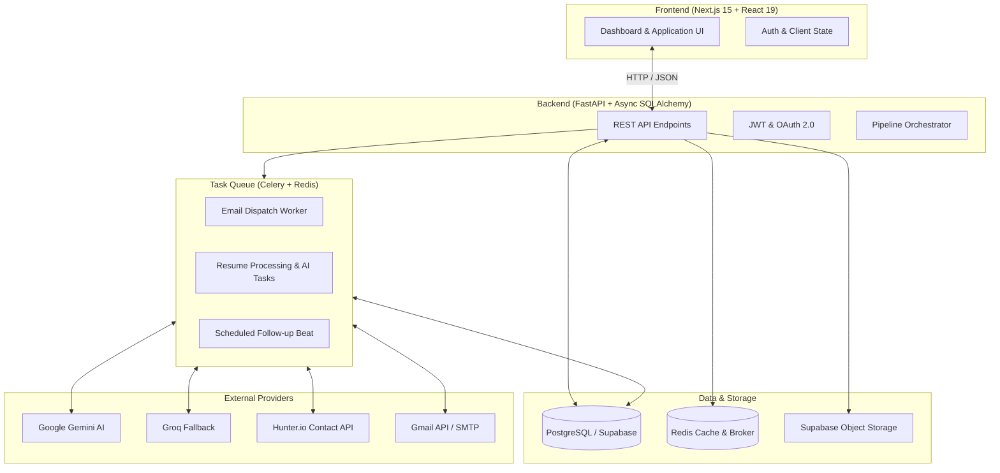

# Ascendra

<div align="center">

**AI-Assisted Career Operating System**

An intelligent, end-to-end platform designed to automate the repetitive aspects of job hunting while maintaining candidate agency and complete user approval.

[](https://fastapi.tiangolo.com)
[](https://nextjs.org)
[](https://react.dev)
[](https://www.postgresql.org)
[](https://docs.celeryq.dev)
[](https://redis.io)
[](https://ai.google.dev/)
[](LICENSE)

[Features](#key-features) | [Architecture](#architecture) | [Tech Stack](#tech-stack) | [Getting Started](#getting-started) | [API Reference](#api-documentation--testing) | [Configuration](#environment-variables) | [Structure](#project-structure)

</div>

---

## Overview

Modern job hunting is fragmented and repetitive: tailoring resumes for every vacancy, finding recruiter contact information, drafting personalized outreach emails, and maintaining application progress across disjointed spreadsheets.

**Ascendra** transforms this workflow into an integrated pipeline. Rather than functioning as a generic AI text generator, Ascendra operates as a career orchestration system built on a **Human-Approval-First** design:
> **AI produces intelligent proposals and tailored materials. The candidate retains final approval over all external communications.**

---

## Key Features

### 1. Resume Intelligence and Tailoring
- **Automated Ingestion**: Upload PDF resumes with automated structured skill, experience, and education extraction.
- **ATS Keyword Alignment**: Evaluates target job descriptions to tailor bullet points and skill placement for ATS algorithms.
- **Immutable Version Tracking**: Retains complete history across all generated iterations with visual diff comparison.

### 2. Opportunity and Contact Discovery
- **Job Discovery Engine**: Aggregates and matches opportunities based on candidate qualifications and career preferences.
- **Decision-Maker Identification**: Identifies relevant recruiters, hiring managers, and department heads using Hunter.io integration.

### 3. Contextual AI Outreach Generation
- **Context-Aware Email Drafting**: Uses Google Gemini (with Groq fallback) to generate personalized initial pitches and follow-up emails.
- **Pre-Send Review and Approval**: Every outreach draft is subject to manual candidate review and editing before entering the delivery queue.

### 4. Asynchronous Email Dispatch and Tracking
- **Queue-Based Dispatch**: Dispatches emails reliably via user-configured SMTP or Google OAuth Gmail API using Celery and Redis.
- **Interaction Tracking**: Monitors message open rates, click-through rates, and thread responses.

### 5. Application Pipeline and Analytics
- **Kanban Pipeline Tracking**: Organizes applications across structured stages (Discovered, Applied, Interviewing, Offered).
- **Performance Analytics**: Measures response rates, stage conversion velocity, and performance comparisons across resume versions.

---

## Architecture



---

## Tech Stack

| Layer | Technologies |
| :--- | :--- |
| **Frontend** | Next.js 15 (App Router), React 19, TypeScript, Tailwind CSS, Lucide React |
| **Backend** | FastAPI, Python 3.11+, SQLAlchemy 2.0 (Asyncio), Alembic, Pydantic v2 |
| **Database & Cache** | PostgreSQL / Supabase, Redis / Upstash |
| **Background Tasks** | Celery, Redis Broker |
| **AI Providers** | Google Gemini API (`google-genai`), Groq API |
| **Document & Delivery** | PyMuPDF, aiosmtplib, Google OAuth / Gmail API |
| **Infrastructure** | Docker, Docker Compose |

---

## Getting Started

### Prerequisites
- Node.js v18.17+ or v20+
- Python 3.11+
- Docker and Docker Compose (Recommended)
- Git

---

### Option 1: Docker Compose Deployment (Recommended)

1. **Clone the repository:**
   ```bash
   git clone https://github.com/JyotikaJayani-08/Ascendra.git
   cd Ascendra
   ```

2. **Configure environment settings:**
   ```bash
   cp .env.example .env
   # Populate .env with your database and API credentials
   ```

3. **Launch all services:**
   ```bash
   docker-compose up --build
   ```

4. **Access the application:**
   - Frontend Application: [http://localhost:3000](http://localhost:3000)
   - Interactive Swagger API Documentation: [http://localhost:8000/docs](http://localhost:8000/docs)
   - ReDoc Documentation: [http://localhost:8000/redoc](http://localhost:8000/redoc)

---

### Option 2: Local Manual Setup

#### 1. Backend Service
```bash
cd backend
python -m venv .venv

# On Windows:
.venv\Scripts\activate
# On Linux/macOS:
source .venv/bin/activate

pip install -r requirements.txt
alembic upgrade head
uvicorn app.main:app --reload --host 0.0.0.0 --port 8000
```

#### 2. Celery Worker (In a separate terminal)
```bash
cd backend
# Ensure virtual environment is active
celery -A app.workers.celery_app worker --loglevel=info
```

#### 3. Frontend Service
```bash
cd frontend
npm install
npm run dev
```

---

## API Documentation & Testing

Ascendra provides complete REST API specifications and interactive testing interfaces:

- **[API Documentation (API_DOCUMENTATION.md)](API_DOCUMENTATION.md)**: Full list of endpoints, request models, query parameters, and JSON response schemas.
- **[Swagger UI & Testing Guide (SWAGGER_GUIDE.md)](SWAGGER_GUIDE.md)**: Guide on how to use FastAPI's auto-generated Swagger UI (`/docs`), authenticate via Bearer token, execute API requests in the browser, and import schemas into Postman.

---

## Environment Variables

Configure the following variables in your root `.env` file:

| Variable | Description | Required |
| :--- | :--- | :---: |
| `DATABASE_URL` | PostgreSQL connection string (`postgresql+asyncpg://...`) | Yes |
| `SUPABASE_URL` | Supabase project URL | Yes |
| `SUPABASE_KEY` | Supabase Anon or Service Role key | Yes |
| `SUPABASE_STORAGE_BUCKET` | Storage bucket for uploaded resumes (default: `resumes`) | Yes |
| `REDIS_URL` | Redis connection URL | Yes |
| `JWT_SECRET` | Secret key for signing JSON Web Tokens | Yes |
| `GEMINI_API_KEY` | Google Gemini API key | Yes |
| `GOOGLE_CLIENT_ID` | Google OAuth client identifier | Optional |
| `GOOGLE_CLIENT_SECRET` | Google OAuth client secret | Optional |
| `SMTP_HOST` / `SMTP_PASSWORD` | SMTP configuration for email delivery | Optional |
| `HUNTER_API_KEY` | Hunter.io API key for recruiter discovery | Optional |
| `GROQ_API_KEY` | Groq API key for LLM fallback | Optional |

---

## Project Structure

```
Ascendra/
├── backend/
│   ├── alembic/              # Database migration scripts
│   ├── app/
│   │   ├── ai/               # Gemini and Groq AI orchestration
│   │   ├── applications/     # Job application state machine and lifecycle
│   │   ├── auth/             # Authentication, JWT, and Google OAuth
│   │   ├── contacts/         # Recruiter and hiring contact discovery
│   │   ├── dashboard/        # Funnel metrics and analytics aggregations
│   │   ├── email/            # Async SMTP and Gmail API dispatch
│   │   ├── jobs/             # Job opportunity search and matching
│   │   ├── notes/            # Notes and application milestones
│   │   ├── notifications/    # Server-Sent Events (SSE) and alert engine
│   │   ├── resumes/          # PDF parsing, tailoring, and version diffs
│   │   ├── workers/          # Celery background tasks
│   │   ├── config.py         # Application settings
│   │   ├── database.py       # Async SQLAlchemy session management
│   │   └── main.py           # FastAPI entrypoint and router registry
│   ├── Dockerfile
│   └── requirements.txt
├── frontend/
│   ├── src/
│   │   ├── app/
│   │   │   ├── dashboard/    # Protected dashboard views
│   │   │   ├── login/        # Authentication pages
│   │   │   ├── register/
│   │   │   └── page.tsx      # Landing page
│   │   ├── components/       # Reusable UI component library
│   │   └── lib/              # API clients and utility helpers
│   ├── Dockerfile
│   └── package.json
├── doc/                      # Architectural specifications and system blueprints
├── docker-compose.yml        # Multi-container orchestration
├── API_DOCUMENTATION.md      # Detailed REST API endpoint specification
├── SWAGGER_GUIDE.md          # Interactive Swagger UI & OpenAPI testing guide
├── LICENSE                   # MIT License
└── README.md                 # Primary project documentation
```

---

## Security and Integrity

- **Strict Approval Model**: Outbound communications are never dispatched without explicit candidate authorization.
- **Provider Abstraction**: Core business workflows are fully isolated from external AI and email provider dependencies.
- **Credential Protection**: Passwords hashed using Argon2; third-party OAuth tokens encrypted and isolated.
- **Traceability**: All meaningful user actions and automated operations generate structured audit records.

---

## License

Distributed under the MIT License. See [LICENSE](LICENSE) for more information.
